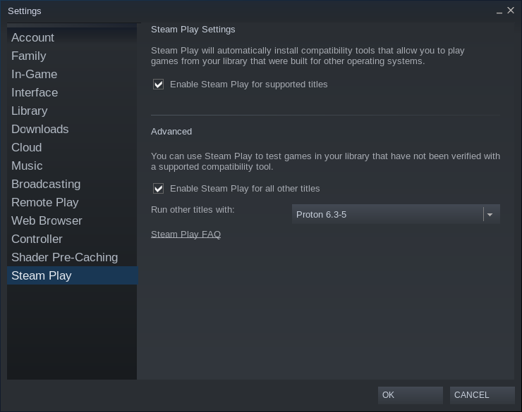
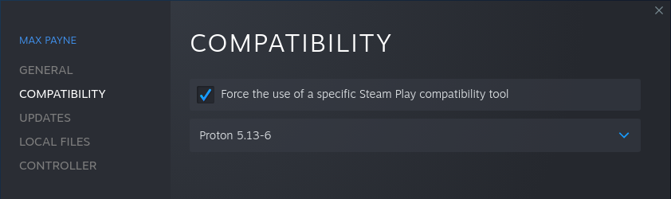
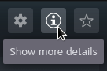
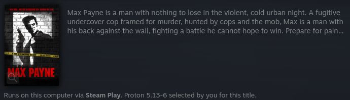
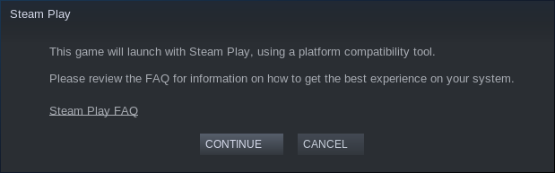
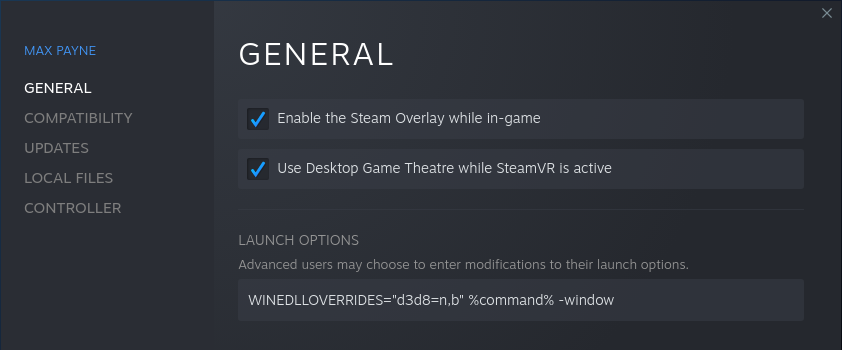
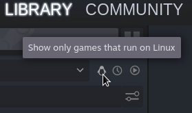

# Linux Gaming on Steam

## How many Steam games are playable on Linux?
Not all of them — but more than you might expect, if all you know about Linux is that most games aren't developed for it. In addition to natively Linux-compatible games, Steam for Linux is able to run an increasing number of games for Windows as well. The Linux version of the Steam client uses a feature called **Steam Play** to run Windows games with compatibility tools. **Proton**, the Steam Play compatibility tool provided by Valve, is based on **Wine**, a compatibility layer for running Windows software on Linux.

### How many Linux games does Steam have?
If you're interested in games with Linux versions, you can filter for that in a search of the Steam store ([`https://store.steampowered.com/search/?category1=998&os=linux`](https://store.steampowered.com/search/?category1=998&os=linux)). You'll notice that each of these games is marked with a little Steam icon; this is a needlessly cryptic indication of Linux support, as that icon actually represents **SteamOS** (the Linux distribution created by Valve).


This doesn't mean you need SteamOS to play these games. Generally, any Linux distro will do.

### How many of Steam's Windows games are playable on Linux?
It's difficult to give an exact number. Proton, like Wine, isn't restricted to running just a static set of games. You can *attempt* to run *any* Windows game; some work perfectly, some don't work at all, and others fall somewhere in between (e.g. they may run but with degraded performance). Both Wine and Proton are under active development, and you'll find that not every game in Steam's huge and ever-growing catalog has been thoroughly tested with the very latest Steam Play tools on every system configuration.

#### Where can I see which games are known to work with Proton?
To get a rough idea of what's playable with Proton, you can take a look at ProtonDB ([`https://www.protondb.com/`](https://www.protondb.com/)), an unofficial site for rating Proton compatibility. Just keep in mind that these compatibility ratings are based on user-generated information which may be incomplete or outdated. Moreover, there are times when a single rating for a game is not sufficient to describe a complex situation, such as when a game works for some users but not for others due to system configuration or hardware differences. If you want to know how well a particular game works, you should probably read the game's recent reports instead of assuming the game's rating tells you everything you need to know.

#### Are there any *official* Proton compatibility ratings?
In the past, Valve has whitelisted some games as officially supported by Steam Play, but these never comprised anything close to an exhaustive list of compatible games, and it seems that Valve has done away with the idea at least for now.

More recently, Valve's focus has been on official compatibility ratings for **Steam Deck**, a handheld device which ships with SteamOS. This rating system does *not* simply measure Linux/Proton compatibility, and instead rates how well games run on Steam Deck in particular, but we can assume that Steam Deck compatibility is a subset of Linux/Proton compatibility. If a game is Steam Deck Verified, it's safe to say that it runs well on Linux, either natively or with Proton. One step down from Verified is the Playable rating, mostly for games which run but are not well suited to the Steam Deck's handheld user interface. Finally, if a game is marked Unsupported, it may be unplayable with Proton or there may just be some issue with Steam Deck in particular (e.g. Steam Deck officially does not support any VR game).

Currently, the games falling under each Steam Deck compatibility rating can be looked up on SteamDB:
* Steam Deck Verified: [`https://steamdb.info/instantsearch/?refinementList[oslist][0]=Steam Deck Verified`](https://steamdb.info/instantsearch/?refinementList%5Boslist%5D%5B0%5D=Steam%20Deck%20Verified)
* Steam Deck Playable: [`https://steamdb.info/instantsearch/?refinementList[oslist][0]=Steam Deck Playable`](https://steamdb.info/instantsearch/?refinementList%5Boslist%5D%5B0%5D=Steam%20Deck%20Playable)
* Steam Deck Unsupported: [`https://steamdb.info/instantsearch/?refinementList[oslist][0]=Steam Deck Unsupported`](https://steamdb.info/instantsearch/?refinementList%5Boslist%5D%5B0%5D=Steam%20Deck%20Unsupported)

## How do I install Steam on Linux?
If it doesn't come pre-installed on your Linux distribution, installing Steam should be easy, provided you're not using an obscure distro whose maintainers have no interest in gaming support. If you're using a beginner-friendly distro like Ubuntu or Mint, you can just search for Steam in your software manager and click "Install". If you want to use the terminal, installing Steam will typically be a one-liner, which will differ depending on your package manager. If your distro uses APT, just run the following:
```
sudo apt install steam
```
You can also download a `.deb` file from [`https://store.steampowered.com/about/`](https://store.steampowered.com/about/) and install it that way, if it's not in your distro's package repository.

## How do I play Steam games on Linux?
Once Steam is installed, downloading and playing a game generally works the same way as on Windows:
* Select a game in your library.
* Click the blue "download" button.
* Click the green "play" button.

If the "download" button is gray and cannot be clicked, and is accompanied by a note that the game is available on Windows, then you need to enable Steam Play for that game.

## How do I enable Steam Play?
You can enable Steam Play for an individual game, for all officially supported games (an option which you'll probably find enabled by default), or for all Windows games (which is what you'll probably want to do).

To enable Steam Play for all of your Windows games:
* Open the Settings window.
* Go to the "Steam Play" tab.
* Make sure **both** of the following options are enabled:
  * "Enable Steam Play for supported titles"
    * This will allow installation of Windows games officially supported by Steam Play.
  * "Enable Steam Play for all other titles"
    * This will additionally allow installation all other Windows games, including the vast majority which haven't been manually verified for Proton compatibility by Valve.
    * The compatibility tool (e.g. Proton version) selected here will be used for all Windows games by default, except for officially supported games which will use Valve's selected Proton version by default. Selecting the latest version of Proton is probably a good choice.

  

* Once your settings are saved, you'll need to restart Steam for these changes to take effect, after which all Windows games should be downloadable.

### How do I change the Steam Play settings for a specific game?
Sometimes a particular game will work best with a specific compatibility tool, which may differ from the one selected in your global Steam settings. Fortunately, this global setting can be overridden on a per-game basis.

To override the default compatibility tool selection for a specific game:
* Right-click the game in your library.
* Select "Properties...".
* Go to the "Compatibility" tab.
* Enable the "Force the use of a specific Steam Play compatibility tool" option.
* Select a compatibility tool from the drop-down menu which appears.

  

The same process is also used to enable Steam Play for only a single game, *without* enabling Steam Play globally — so if you really want to pick and choose which Windows games can be installed, you can do that.

Steam Play can also be enabled this way for a natively Linux-compatible game, thus forcing Steam to run the Windows version of it, which may be useful if the game's Linux build happens to be broken due to developer neglect or some other issue. If you already have the Linux version of the game installed, Steam will automatically replace it with the Windows version upon selection of a compatibility tool.

### How do I see which Steam Play compatibility tool will be used for a specific game?
* Select a game in your library and click the "Show more details" button on the right-hand side of the window.

  
  
* The bottom of the expanded area should indicate which compatibility tool, if any, is in use.

  

## How do I run a game with Steam Play?
If you've enabled Steam Play (see above), just try running the game as you would do on Windows, and Steam will launch it using the selected compatibility tool. When running any game with Steam Play for the first time, you'll see a message like this one pop up:



Click "continue" and Steam will attempt to run the game. In the absolute best case, that notification will be the only indication that you're not running the game on its native operating system... and yes, in the worst case, the game might not run.

### What if the game doesn't work?
Unfortunately, Windows game compatibility on Linux is not perfect, and some games might not run properly. The good news is that some games which don't work "out of the box" might actually be playable with a bit of additional configuration. Sometimes the solution for getting a game to work with Proton is as simple as enabling or disabling some setting by adding an environment variable to the launch options.

If you're having trouble running a Windows game with Proton, you might want to look it up on ProtonDB ([`https://www.protondb.com/`](https://www.protondb.com/)) to find out whether the game is known to have issues or whether it's just you. If there's a known fix for the game, it will usually be mentioned in one of the reports.

Compatibility reports are also submitted to the Proton issue tracker on GitHub ([`https://github.com/ValveSoftware/Proton/issues`](https://github.com/ValveSoftware/Proton/issues)). You could look up the game there, and check the comments to see if anyone has documented a tweak or workaround that gets it running.

In some cases, you might also want to take a look at PC Gaming Wiki ([`https://www.pcgamingwiki.com/`](https://www.pcgamingwiki.com/)). You won't find a lot of specifically Linux-related content, but there is some. Also, if an older game simply requires patching to be suitable for modern Windows, then it might require the same patching on Linux.

#### What if a patch or mod doesn't work?
Some patches and mods may require additional launch options. For example, ThirteenAG's widescreen fix for *Max Payne* ([`https://thirteenag.github.io/wfp#mp1`](https://thirteenag.github.io/wfp#mp1)) works by adding a DLL file, `d3d8.dll`, and you'll need to add `WINEDLLOVERRIDES="d3d8=n,b" %command%` to the game's launch options in order to make that DLL file work when running the game with Proton. With any luck, someone on the internet will have documented any non-obvious steps for applying popular patches to Windows games on Linux.

### How do I add environment variables and other launch options?
* Right-click the game in your library.
* Select "Properties...".
* Go to the "General" tab.
* Type or paste the launch option(s) into the text field.

  

  * The launch options field is often used to set environment variables, e.g. `PROTON_USE_WINED3D=1`; these need to be followed by `%command%`.
  * Command-line arguments to the game itself, e.g. `-window` to enable windowed mode, may then follow `%command%`.
  * The `%command%` part may be omitted if you're not going to put anything before it.

Some environment variables for Proton are documented in the README on GitHub ([`https://github.com/ValveSoftware/Proton/`](https://github.com/ValveSoftware/Proton/)).

## How do I install additional Steam Play compatibility tools?
You'll have to follow the README for the compatibility tool you're trying to install, but these installations typically involve unpacking some files into the `~/.steam/root/compatibilitytools.d` folder and then restarting Steam.

### What other Steam Play compatibility tools are available?
Here are a few:
* Proton-GE ([`https://github.com/GloriousEggroll/proton-ge-custom`](https://github.com/GloriousEggroll/proton-ge-custom)), a custom build of Proton which fixes issues in some games.
* Steam Tinker Launch ([`https://github.com/frostworx/steamtinkerlaunch`](https://github.com/frostworx/steamtinkerlaunch)), a tool for automatically applying tweaks to games and customizing how they run.
  * This can be used either as a Steam Play compatibility tool or as a launch option (`steamtinkerlaunch %command%`).
* Boxtron ([`https://github.com/dreamer/boxtron`](https://github.com/dreamer/boxtron)), for running DOSBox-powered games with the native Linux version of DOSBox if Steam provides only a Windows version.
* Roberta ([`https://github.com/dreamer/roberta`](https://github.com/dreamer/roberta)), for running ScummVM-powered games with the native Linux version of ScummVM if Steam provides only a Windows version.
* Luxtorpeda ([`https://github.com/luxtorpeda-dev/luxtorpeda`](https://github.com/luxtorpeda-dev/luxtorpeda)), for running various games with their respective Linux-native source ports or engine re-implementations.
  * Supported games: [`https://luxtorpeda-dev.github.io/packages.html`](https://luxtorpeda-dev.github.io/packages.html)

## How do I view only my Linux games?
Interestingly, the Steam client for Linux does not seem to provide an easy way to see, at a glance, which of the games in one's library are natively Linux-compatible. The option technically does exist, but does not work as you might expect. You may have noticed this "games that run on Linux" filter represented by a little penguin button:



However, this is not a filter for Linux-native games. If you've enabled Steam Play for all games, then Steam thus considers all Windows games to be runnable on Linux; in this case, the filter really has no effect. You can disable the global Steam Play settings in order to make this filter show only the games in your library which run natively on Linux, but changing that option requires a restart of the Steam client.

## Where are my games installed?
By default, your games will be installed somewhere under your home directory, typically under `~/.steam/root/steamapps/common`. This includes both Linux games and Windows games. Meanwhile, the Wine prefix for each Windows game executed with Proton will be under `~/.steam/root/steamapps/compatdata`.

## Other miscellaneous notes:
* Protontricks ([`https://github.com/Matoking/protontricks`](https://github.com/Matoking/protontricks)) is a Winetricks wrapper for use with Steam Play and Proton.
  * Winetricks ([`https://github.com/Winetricks/winetricks`](https://github.com/Winetricks/winetricks)) helps to automate various tweaks such as changing Wine's configuration and installing missing dependencies.
* Lutris ([`https://lutris.net/`](https://lutris.net/)) can import your games from Steam and other stores, and might help you run them more easily.
* GameHub ([`https://github.com/tkashkin/GameHub/`](https://github.com/tkashkin/GameHub/)) also integrates with Steam and other stores.
* GameDataPackager ([`https://wiki.debian.org/Games/GameDataPackager`](https://wiki.debian.org/Games/GameDataPackager)), a tool which packages non-free game data for use with free Linux-native engines, is able to locate installed Steam games automatically.
